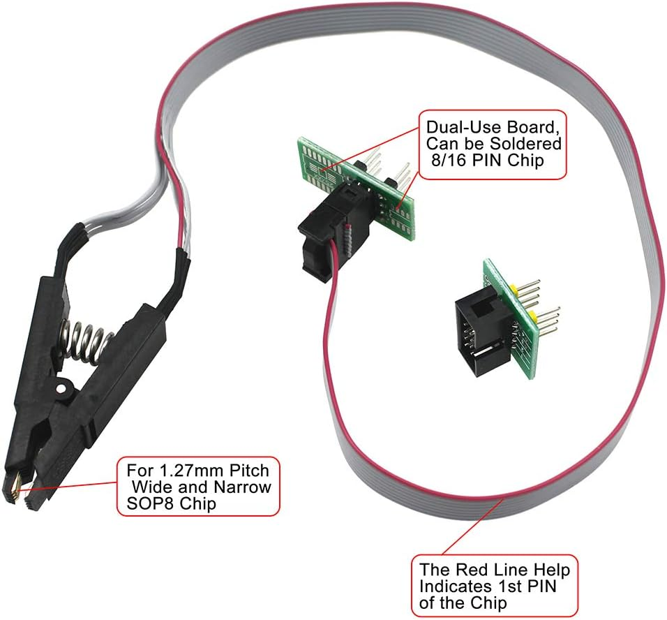
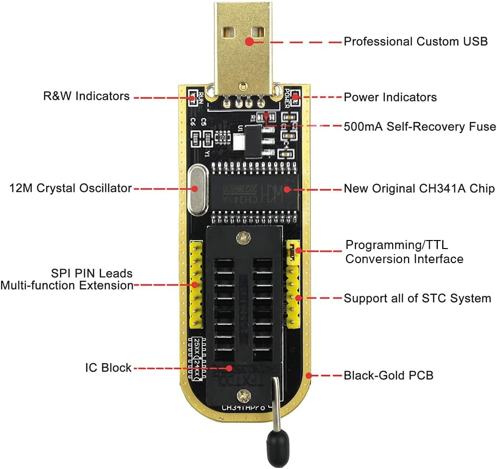
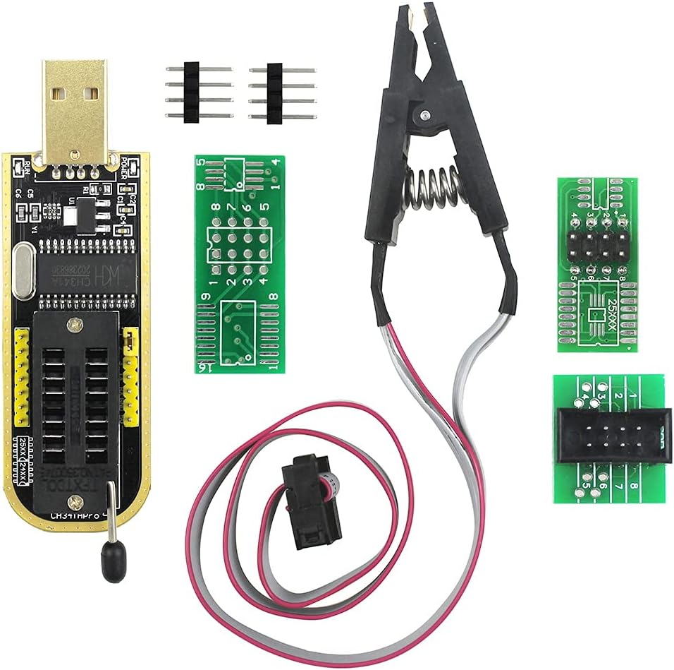
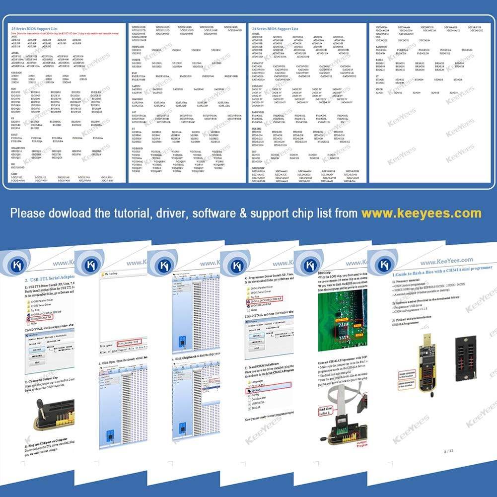

# KeeYees SOP8 SOIC8 Test Clip and CH341A USB Programmer Flash for Most of 24 25 Series BIOS Chip

**NOTE(JEFF):** This is a [forked repository](https://github.com/Keeyees/CH341A-Manual-NEW-JP.git) and exists here for my own personal references.

**NOTE(JEFF):** The license of the files inside of this repository is unknown to me.

## product

- [Amazon: KeeYees SOP8 SOIC8 Test Clip and CH341A USB Programmer Flash for Most of 24 25 Series BIOS Chip with PDF Tutorial](https://www.amazon.com/dp/B07SHSL9X9/ref=sspa_mb_hqp_detail_mobile_aax_0?ie=UTF8&psc=1&sp_csd=d2lkZ2V0TmFtZT1zcF9ocXBfcGhvbmVfc2hhcmVk)

### photos

## bugs, questions and issues

Please file your bug reports and questions back to the [original repository](https://github.com/Keeyees/CH341A-Manual-NEW-JP/issues)
